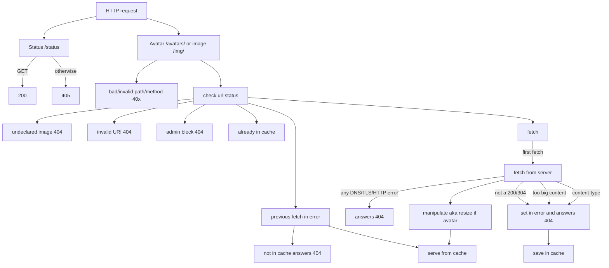
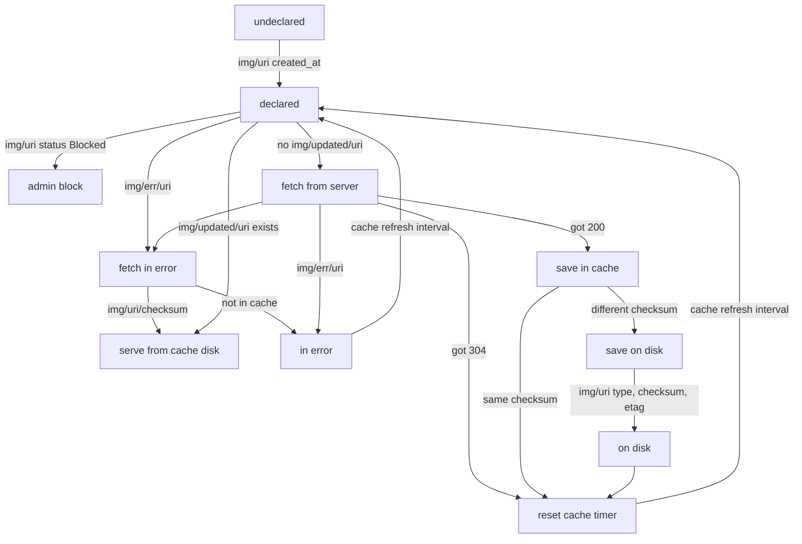

External images on LinuxFr.org
==============================

Our users can use images from external domains on LinuxFr.org.
This component is a reverse-proxy / cache for these images.

The main benefits of using a proxy instead of linking directly the images are:

- **No flood**: images can be hosted on small servers that are not able to
  handle all the traffic from LinuxFr.org, so we avoid to flood them
- **History**: even if a server is taken down, we are able to keep serving
  images that are already used on our pages
- **Security**: on the HTTPS pages, we won't include images from other domains
  that are available only in HTTP, so it prevents browsers from displaying
  warning about unsafe pages
- **Privacy**: the users won't connect to the external domains, so their IP
  addresses won't be logged on these servers.

Side effects:

- file is changed on remote side (modified or converted into another format), new file will be served after the next fetch
- file is deleted on remote side, file won't be served after the next try to fetch

How to use it? (outside Docker)
-------------------------------

[Install Go](http://golang.org/doc/install) and don't forget to set `$GOPATH`

    $ go get -v -u github.com/linuxfrorg/img-LinuxFr.org
    $ img-LinuxFr.org [-a addr] [-r redis] [-l log] [-d dir] [-u agent] [-e avatar] [-c]

And, to display the help:

    $ img-LinuxFr.org -h

How to use it? (with Docker)
-------------------------------

Build and run Docker image:

    $ docker build -t linuxfr.org-img .
    $ docker run --publish 8000:8000 linuxfr.org-img
    or
    $ docker run --publish 8000:8000 --env REDIS=someredis:6379/1 linuxfr.org-img

How it works?
-------------

Accepted requests are:
- `GET /status` (expected answer is HTTP 200 with "OK" body)
- `GET /img/<encoded_uri>` or `GET /img/<encoded_uri>/<filename>`
- `GET /avatars/<encoded_uri>` or `GET /avatars/<encoded_uri>/<filename>`

where `<filename>` is the name given to the file, and `encoded_uri` is the `uri` converted into hexadecimal string.

Example: `http://nginx/red_100x100.png` could be accessed as `GET /img/687474703A2F2F6E67696E782F7265645F313030783130302E706E67/square_red.png`



- HTTP 404s for avatars are converted into redirection to default avatar address.
- `declared` means that `img/<uri>` in Redis contains a `created_at` field.
- `admin block` means that `img/<uri>` in Redis contains a `status` field with "Blocked" value.
- `in error` means that `img/err/<uri>` in Redis exists and file is not in cache from a previous fetch.
- `in cache` means that `img/<uri>` in Redis contains a `checksum` field. And if img/updated/<uri>` exists, the cache is up-to-date this remote server.



Redis schema
------------
(extracted from [full LinuxFr.org Redis schema](https://github.com/linuxfrorg/linuxfr.org/blob/master/db/redis.txt))

Key                                            | Type   | Value                 | Expiration | Description
---------------------------------------------- | ------ | --------------------- | ---------- | -------------------
`img/<uri>`                                    |  hash  |                       |     no     | Images, with fields 'created_at': seconds since Epoch, 'status': 'Blocked' if administratively blocked (by moderation), 'type': content-type like 'image/jpeg' (set by `img` daemon), 'checksum': SHA1 (set by `img` daemon), and 'etag': etag (set by `img` daemon)
`img/blocked`                                  |  list  |         URIs          |     no     | Images blocked by moderation team
`img/err/<uri>`                                | string |         error         |     1h     | Image fetch in error, like "Invalid content-type", created by `img` daemon
`img/latest`                                   |  list  |         URIs          | no, limited| Last images as `<uri>`, limited to NB_IMG_IN_LATEST = 100
`img/updated/<uri>`                            | string |        modtime        |     1h     | Cached images, created by `img` daemon, value like "Thu, 12 Dec 2013 12:28:47 GMT"

Testsuite
---------
Testsuite requires docker-compose.

```bash
cd tests/
docker-compose up --build
```

If everything went well, expect at the end:

```
linuxfr.org-img-test_1  | All tests looks good!
tests_linuxfr.org-img-test_1 exited with code 0
```

Extra checks (linter for Dockefile, Go, and vulnerability/secret scan):

```bash
docker run --rm --interactive hadolint/hadolint < Dockerfile
docker run --rm --volume $(pwd)/Dockerfile:/app/Dockerfile --workdir /app replicated/dockerfilelint Dockerfile
docker run --rm --interactive hadolint/hadolint < tests/Dockerfile
docker run --rm --volume $(pwd)/tests/Dockerfile:/app/Dockerfile --workdir /app replicated/dockerfilelint Dockerfile
docker run --rm --tty --volume $(pwd):/app --workdir /app golangci/golangci-lint:v1.64.3 golangci-lint run -v
docker run --rm --volume $(pwd):/app --workdir /app aquasec/trivy repo .
```

See also
--------

* [Git repository for img-LinuxFr.org](https://github.com/linuxfrorg/img-LinuxFr.org)

Copyright
---------

The code is licensed as GNU AGPLv3. See the LICENSE file for the full license.

♡2012-2018 by Bruno Michel. Copying is an act of love. Please copy and share.

2022-2025 by Benoît Sibaud and Adrien Dorsaz.
